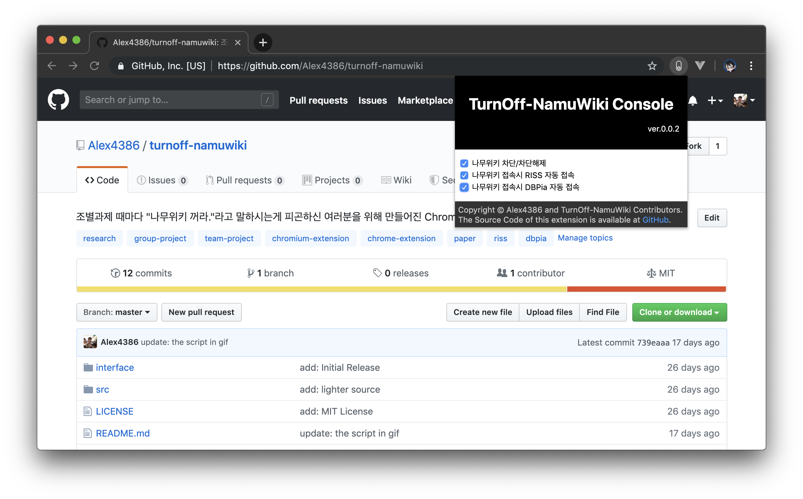
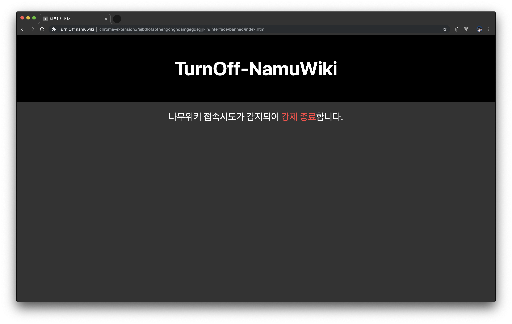

# turnoff-namuwiki
조별과제 때마다 "나무위키 꺼라."라고 말하시는게 피곤하신 여러분을 위해 만들어진 **Browser** Extension,  
**나무위키를 꺼 드립니다.**  
  
***이제 파이어폭스도 (실험적) 지원합니다***  

***@SLoWMoTIoN 님 이거 타입스크립트로 마이그레이션 했는데 이거 오류 좀 잡아주세요.***  

## 이런 분들께 추천드립니다!
* 꼭 조별과제 때 마다 출처: 나무위키 쓰시는 분
* 논문 검색해야 하는 데, 나도 모르게 나무위키 들어가시는 분
* 일반인이라 굳이 논문까지는 필요 없으신 분  

## What's this?
나무위키에 접속할 때, 설정에 따라 DBPia 또는 Riss 같은 공신력있는 논문 웹페이지로 대신 리다이렉트 되는 확장입니다.  

## TODO
* add google scholar search
* ~~fix the bug that dbpia and riss tab spawn twice in a row~~ (FIXED?)

## Screenshots
  
  

## How to Install
  
### Chrome
크롬 익스텐션 스토어에 올렸습니다! [Turnoff-NamuWiki](https://chrome.google.com/webstore/detail/turn-off-namuwiki/dgdifdnmamleoebgfbfeckefhhhplmdn/related?hl=en)  

신기능을 누구보다 빠르게 테스트 해보고 싶으시다고요? 아래 방법을 사용하세요!  
1. 이 레포지토리를 클론합니다.
2. 레포지토리의 의존성을 설정하기 위해, `npm install` 또는 `yarn install` 명령을 실행합니다.
3. 레포지토리의 터미널에서 `npm run build` 또는 `yarn build` 명령을 통해 TypeScript 코드를 빌드합니다.
4. 크롬의 확장 프로그램 페이지(chrome://extensions)로 들어갑니다
5. 우측 상단의 개발자모드를 활성화 합니다.
6. [압축해제된 확장프로그램을 로드합니다.] 를 클릭합니다.
7. 압축해제된 확장프로그램 폴더를 선택합니다. (레포 전체, manifest.json 이 위치한 곳)
8. 확장프로그램 섹션의 스위치 아이콘을 클릭해 익스텐션의 상세 설정을 할 수 있습니다.

### Firefox
파이어폭스 애드온 검수 중입니다! [Turnoff-NamuWiki](https://addons.mozilla.org/en-US/firefox/addon/turnoff-namuwiki/)

지금 바로 적용하고 싶은 경우, 아래 방법을 사용하세요!  
1. 이 레포지토리를 클론합니다.
2. 레포지토리의 의존성을 설정하기 위해, `npm install` 또는 `yarn install` 명령을 실행합니다.
3. 레포지토리의 터미널에서 `npm run build` 또는 `yarn build` 명령을 통해 TypeScript 코드를 빌드합니다.
4. 파이어폭스의 메뉴를 열고 확장기능 (Add-ons)을 선택합니다.
5. 우측 상단의 톱니바퀴를 누르고 확장기능 디버그 (Debug Add-ons) 를 선택합니다.
6. 확장기능 디버깅하기를 체크하고, 임시 확장기능 로드 버튼을 누릅니다.
7. 압축해제된 확장프로그램 폴더로 들어가 manifest.json을 선택합니다.
8. 확장프로그램 섹션의 스위치 아이콘을 클릭해 익스텐션의 상세 설정을 할 수 있습니다.

## For Firefox Add-on Team
Source-Code of this extension is also available at GitHub, [GitHub](https://github.com/Alex4386/turnoff-namuwiki).  
Code in dist/ is **transpiled**, so, Please check the source code written in typescript is available at src/.  

## License
Distributed under MIT License  
Copyright &copy; Alex4386
