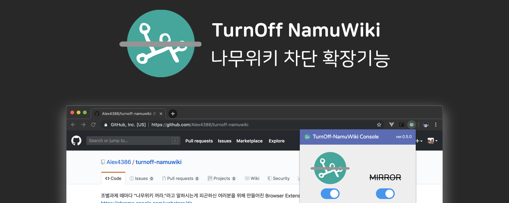

  

# turnoff-namuwiki
**자료조사, 조별과제의 지뢰, 나무위키를 꺼드립니다.**  
  
  
  
Official Discord Community: [https://discord.gg/GcXFubz](https://discord.gg/GcXFubz)

## Notification - 알림
업데이트를 빠르게 확인하고 싶다면, Chrome 버전보다는 Firefox 버전을 권장합니다.  
Firefox 애드온 팀의 심사가 10분 이내로 끝나는 것에 비해 Chrome 팀은 대략 하루에서 3일, Whale 팀은 최대 일주일 소요됩니다.  
  
If you want faster updates, Please use Firefox version instead of chrome version.  
Firefox does their examination within 10 minutes, instead Chrome takes at least a day to 3 days.

## Table of Contents
* [한국어](#한국어)
  * [설명](#설명)
  * [설치 방법](#설치-방법)
    * [Mozilla Firefox](#mozilla-firefox)
    * [Google Chrome (or Chromium)](#google-chrome-or-chromium)
  * [기여자를 위한 개발 문서](#기여자를-위한-개발-문서)
  * [패키징 방법](#패키징-방법)
* [English](README.en.md)
* [For Firefox Add-on Team](#for-firefox-add-on-team)
* [TODO](#TODO)
* [License](#License)

## 한국어
### 설명
기본적으로는, 나무위키 접속 차단 후 논문사이트로 리다이렉트 해주는 브라우저 확장입니다.
필요에 따라 다음과 같이 사용할 수 있습니다:  
- 나무위키 접속 차단: _중요한 자료조사에서 `출처: 나무위키` 는 피해야 합니다. 이 확장은 이런 사태를 접속 차단을 통해 원천 방지합니다.  
- 논문사이트로 리다이렉트: 나무위키 문서를 클릭하거나 접속한 경우, 논문사이트로 리다이렉트 합니다. (옵션에서 켜거나 끌 수 있습니다)
- 나무위키 광고차단: 지긋지긋한 파워링크 광고, 나무뉴스 등을 차단해 쾌적한 문서 열람환경을 지원합니다. (나무위키의 라이센스 위반 행위 방지는 덤입니다)
- 검색 결과 필터링: 나무위키 문서가 검색 결과에 나오지 않도록 필터링합니다. (옵션에서 켜거나 끌 수 있습니다)

### 설치 방법

#### Mozilla Firefox
파이어폭스 애드온 스토어에 올렸습니다! [파이어폭스 스토어](https://addons.mozilla.org/en-US/firefox/addon/turnoff-namuwiki/)  
**최대한 빠른 업데이트를 위해 Mozilla Firefox 버전을 권장합니다** 

신기능을 누구보다 빠르게 테스트 해보고 싶으시다고요? 아래 방법을 사용하세요!  
1. 이 레포지토리를 클론합니다.
2. 레포지토리의 의존성을 설정하기 위해, `npm install` 또는 `yarn install` 명령을 실행합니다.
3. 레포지토리의 터미널에서 `npm run build` 또는 `yarn build` 명령을 통해 TypeScript 코드를 빌드합니다.
4. `node ./firefox_workaround.js` 을 실행합니다.
5. 파이어폭스의 메뉴를 열고 확장기능 (Add-ons)을 선택합니다.
6. 우측 상단의 톱니바퀴를 누르고 확장기능 디버그 (Debug Add-ons) 를 선택합니다.
7. 확장기능 디버깅하기를 체크하고, 임시 확장기능 로드 버튼을 누릅니다.
8. 앞에서 클론한 폴더로 들어가 manifest.json을 선택합니다.
9. 확장프로그램 섹션의 아이콘을 클릭해 익스텐션의 상세 설정을 할 수 있습니다.
  
#### Google Chrome (or Chromium 계통)
크롬 익스텐션 스토어에 올렸습니다! [Turnoff-NamuWiki](https://chrome.google.com/webstore/detail/turn-off-namuwiki/dgdifdnmamleoebgfbfeckefhhhplmdn/related?hl=en)  
Firefox 에 비해선 릴리즈가 늦습니다. Google 에서는 Firefox 처럼 소스코드 업로드를 할 수 있는 부분이 없어 검수가 오래 걸려 늦는 것 같습니다.

신기능을 누구보다 빠르게 테스트 해보고 싶으시다고요? 아래 방법을 사용하세요!  
1. 이 레포지토리를 클론합니다.
2. 레포지토리의 의존성을 설정하기 위해, `yarn install` 명령을 실행합니다.
3. 레포지토리의 터미널에서 `yarn build` 명령을 통해 TypeScript 코드를 빌드합니다.
4. 크롬의 확장 프로그램 페이지(chrome://extensions)로 들어갑니다
5. 우측 상단의 개발자모드를 활성화 합니다.
6. [압축해제된 확장프로그램을 로드합니다.] 를 클릭합니다.
7. 앞에서 클론한 폴더를 선택합니다. (레포 전체, manifest.json 이 위치한 곳)
8. 확장프로그램 섹션의 아이콘을 클릭해 익스텐션의 상세 설정을 할 수 있습니다.

### 기여자를 위한 개발 문서
[CONTRIBUTORS.md](CONTRIBUTORS.md) 문서를 참고해 주세요!

### 패키징 방법

현재 자동 패키징은 macOS, Linux System 에서만 가능합니다.  
의존성으로 시스템 패키지 `zip` 이 설치되어있는 지 확인해 주세요.  

1. 이 레포지토리를 클론합니다.
2. 레포지토리의 의존성을 설정하기 위해, `npm install` 또는 `yarn install` 명령을 실행합니다.
3. 레포지토리의 터미널에서 `npm run build-package` 또는 `yarn build-package` 명령을 통해 TypeScript 코드를 빌드, 그리고 압축합니다. (자동으로 진행됨)
4. 레포지토리 안에 있는 `turnoff-namuwiki.zip`, `turnoff-namuwiki@alex4386.us.xpi` 파일을 확인합니다.

## English
See [README.en.md](README.en.md) for English version.

## TODO
* IntelliBan Engine (powered by Firebase)
* Create an Issue for more Feature Requests!

## For Firefox Add-on Team

Please refer to [firefox_addon_team_README.md](firefox_addon_team_README.md) for more details on how to build the reproducable build on your system.  

## License
Distributed under MIT License  
Copyright &copy; Alex4386 and TurnOff-NamuWiki Contributors
