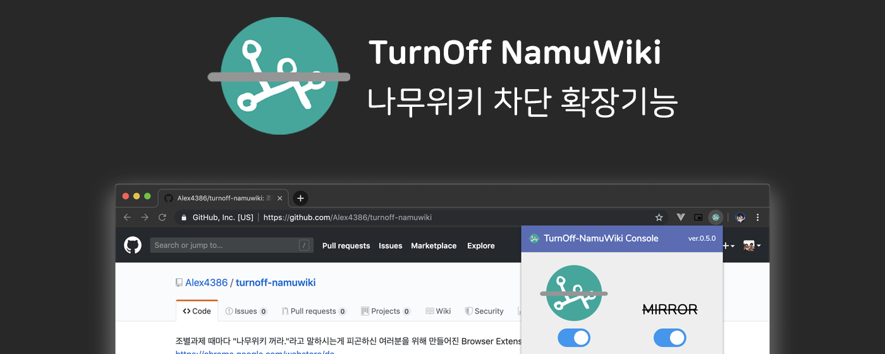

  

# turnoff-namuwiki
조별과제 때마다 "나무위키 꺼라."라고 말하시는게 피곤하신 여러분을 위해 만들어진 **Browser** Extension,  
**나무위키를 꺼 드립니다.**  
Official Discord Community: [https://discord.gg/Aak86y](https://discord.gg/Aak86y)

## Table Of Contents
* [한국어](#한국어)
  * [이런 분들께 추천드립니다!](#이런-분들께-추천드립니다)  
  * [이게 무엇인가요?](#이게-무엇인가요)
  * [설치 방법](#설치-방법)
    * [Google Chrome (or Chromium)](#google-chrome-or-chromium)
    * [Mozilla Firefox](#mozilla-firefox)
  * [기여자를 위한 개발 문서](#기여자를-위한-개발-문서)
  * [패키징 방법](#패키징-방법)
* [English](#English)
  * [This extension/add-on is for...](#This-extensionadd-on-is-for)
  * [What's this?](#whats-this)
  * [How to Install](#how-to-install)
    * [Google Chrome (or Chromium)](#google-chrome-or-chromium-1)
    * [Mozilla Firefox](#mozilla-firefox-1)
  * [How to Package](#how-to-package)
* [TODO](#TODO)
* [For Firefox Add-on Team](#for-firefox-add-on-team)
* [License](#License)

## 한국어
### 이런 분들께 추천드립니다!
* 꼭 조별과제 때 마다 출처: 나무위키 쓰시는 분
* 논문 검색해야 하는 데, 나도 모르게 나무위키 들어가시는 분
* 일반인이라 굳이 논문까지는 필요 없으신 분  

### 이게 무엇인가요?
나무위키에 접속할 때, 설정에 따라 DBPia, Riss, 구글 학술검색, arXiv 같은 공신력있는 논문 웹페이지로 대신 리다이렉트 되는 확장입니다.  

### 설치 방법
  
#### Google Chrome (or Chromium)
크롬 익스텐션 스토어에 올렸습니다! [Turnoff-NamuWiki](https://chrome.google.com/webstore/detail/turn-off-namuwiki/dgdifdnmamleoebgfbfeckefhhhplmdn/related?hl=en)  

신기능을 누구보다 빠르게 테스트 해보고 싶으시다고요? 아래 방법을 사용하세요!  
1. 이 레포지토리를 클론합니다.
2. 레포지토리의 의존성을 설정하기 위해, `npm install` 또는 `yarn install` 명령을 실행합니다.
3. 레포지토리의 터미널에서 `npm run build` 또는 `yarn build` 명령을 통해 TypeScript 코드를 빌드합니다.
4. 크롬의 확장 프로그램 페이지(chrome://extensions)로 들어갑니다
5. 우측 상단의 개발자모드를 활성화 합니다.
6. [압축해제된 확장프로그램을 로드합니다.] 를 클릭합니다.
7. 앞에서 클론한 폴더를 선택합니다. (레포 전체, manifest.json 이 위치한 곳)
8. 확장프로그램 섹션의 아이콘을 클릭해 익스텐션의 상세 설정을 할 수 있습니다.

#### Mozilla Firefox
파이어폭스 애드온 스토어에 올렸습니다! [Turnoff-NamuWiki](https://addons.mozilla.org/en-US/firefox/addon/turnoff-namuwiki/)

신기능을 누구보다 빠르게 테스트 해보고 싶으시다고요? 아래 방법을 사용하세요!  
1. 이 레포지토리를 클론합니다.
2. 레포지토리의 의존성을 설정하기 위해, `npm install` 또는 `yarn install` 명령을 실행합니다.
3. 레포지토리의 터미널에서 `npm run build` 또는 `yarn build` 명령을 통해 TypeScript 코드를 빌드합니다.
4. 파이어폭스의 메뉴를 열고 확장기능 (Add-ons)을 선택합니다.
5. 우측 상단의 톱니바퀴를 누르고 확장기능 디버그 (Debug Add-ons) 를 선택합니다.
6. 확장기능 디버깅하기를 체크하고, 임시 확장기능 로드 버튼을 누릅니다.
7. 앞에서 클론한 폴더로 들어가 manifest.json을 선택합니다.
8. 확장프로그램 섹션의 아이콘을 클릭해 익스텐션의 상세 설정을 할 수 있습니다.

### 기여자를 위한 개발 문서
[CONTRIBUTORS.md](CONTRIBUTORS.md) 문서를 참고해 주세요!

### 패키징 방법

현재 자동 패키징은 macOS, Linux System 에서만 가능합니다.  
의존성으로 시스템 패키지 `zip` 이 설치되어있는 지 확인해 주세요.  

1. 이 레포지토리를 클론합니다.
2. 레포지토리의 의존성을 설정하기 위해, `npm install` 또는 `yarn install` 명령을 실행합니다.
3. 레포지토리의 터미널에서 `npm run build-package` 또는 `yarn build-package` 명령을 통해 TypeScript 코드를 빌드, 그리고 압축합니다. (자동으로 진행됨)
4. 레포지토리 안에 있는 `turnoff-namuwiki.zip`, `turnoff-namuwiki@alex4386.us.xpi` 파일을 확인합니다.

## English

### This extension/add-on is for...
* Who writes `Citation: NamuWiki` on group projects
* who goes to namuwiki when you need to search some journals
* Who needs no journal at all because you are just a normal person

### What's this?
It redirects you to journal webpages (ex. DBpia, RISS, arXiv, Google Scholar) by configuration.  

### How to Install

#### Google Chrome (or Chromium) and Microsoft Edge Developer Edition 
It is now available at Chrome Web Store! [Turnoff-NamuWiki](https://chrome.google.com/webstore/detail/turn-off-namuwiki/dgdifdnmamleoebgfbfeckefhhhplmdn/related?hl=en)  

Do you want to test some latest feature? follow this directions!  
1. Clone this repository.
2. In order to install its dependencies, Run `npm install` or `yarn install` command.
3. To build, Use command `npm run build` or `yarn build` to compile TypeScript code.
4. Go to Chrome/Chromium's extension page (chrome://extensions).
5. Enable Developer mode at top-right corner.
6. Click [Load Unpacked Extension...].
7. Select the entire repository (Where manifest.json is located)
8. You can use the Turnoff-NamuWiki icon for configuration.

#### Mozilla Firefox
It's now available at Firefox Add-ons! [Turnoff-NamuWiki](https://addons.mozilla.org/en-US/firefox/addon/turnoff-namuwiki/)

Do you want to test some latest feature? follow this directions!  
1. Clone this repository.
2. In order to install its dependencies, Run `npm install` or `yarn install` command.
3. To build, Use command `npm run build` or `yarn build` to compile TypeScript code.
4. Open firefox menu and select Add-ons.
5. Select the gear icon and click Debug Add-ons.
6. Check Debug Add-ons, and click Load Temporary Add-ons.
7. Go to cloned repository and select manifest.json.
8. You can use the Turnoff-NamuWiki icon for configuration.

### How to Package

Currently Auto-Packaging is only supported on Linux and macOS systems.   
Please instanll dependency `zip` before you follow the instruction.  

1. Clone this repository
2. In order to install its dependencies, Run `npm install` or `yarn install` command.
3. To build a package, Use command `npm run build-package` or `yarn build-package` to compile TypeScript code and make a zip and xpi file.
4. Check the file `turnoff-namuwiki.zip`, `turnoff-namuwiki@alex4386.us.xpi` in the repository.

## TODO
* IntelliBan Engine (powered by Firebase)
* Create an Issue for more Feature Requests!

## For Firefox Add-on Team

Please refer to [firefox_addon_team_README.md](firefox_addon_team_README.md) for more details on how to build the reproducable build on your system.  

## License
Distributed under MIT License  
Copyright &copy; Alex4386 and TurnOff-NamuWiki Contributors
